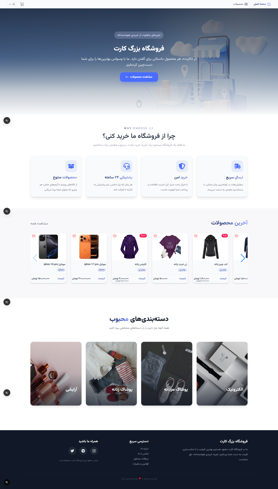
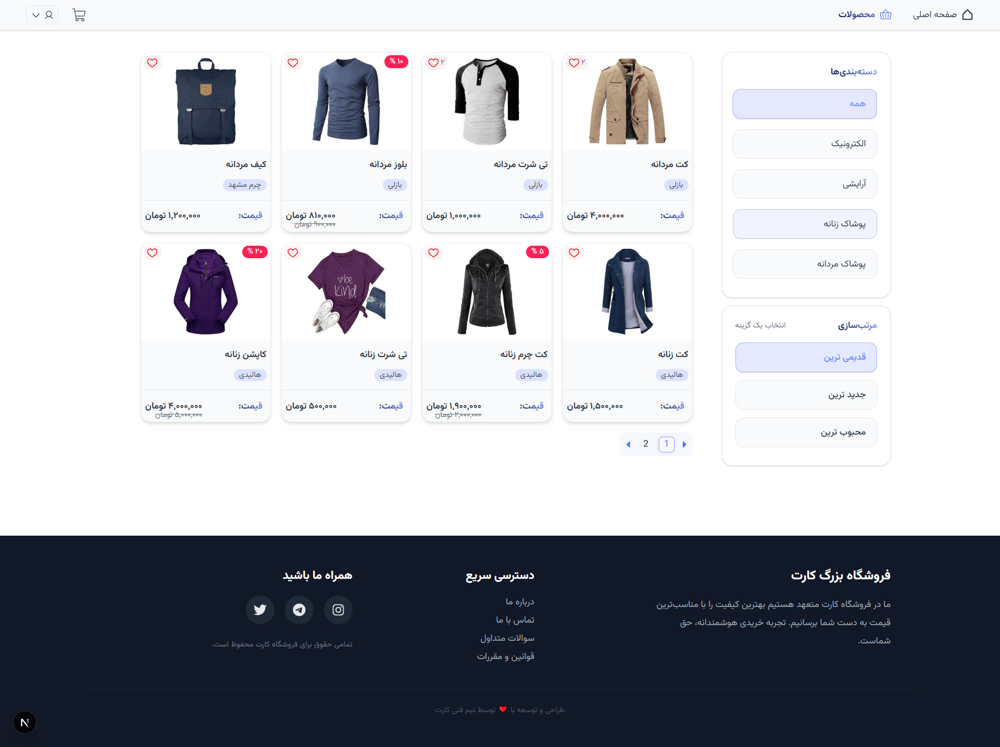
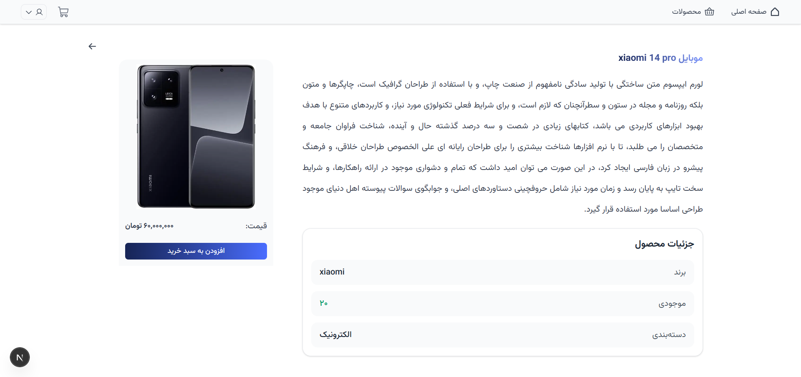
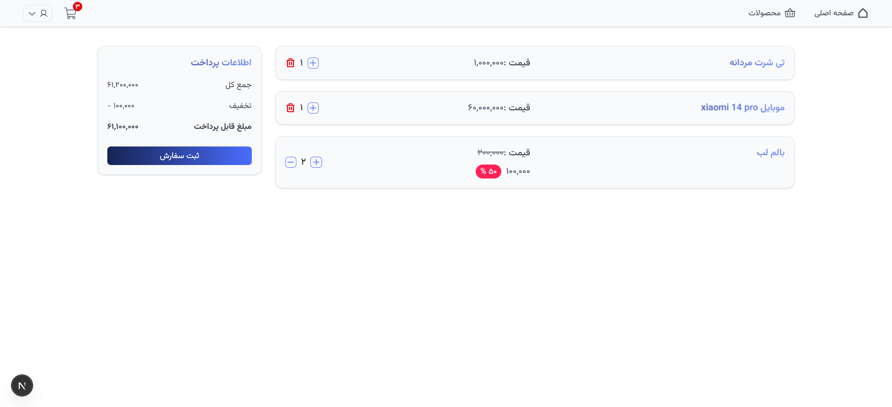
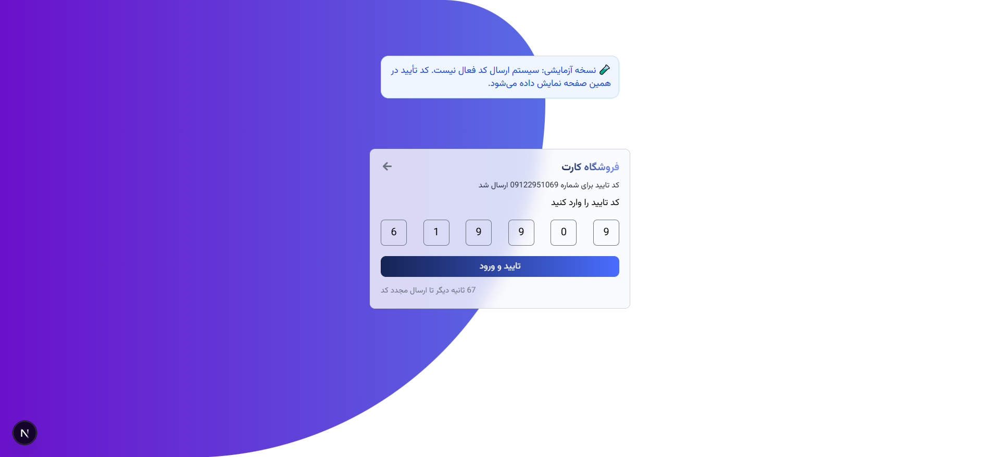
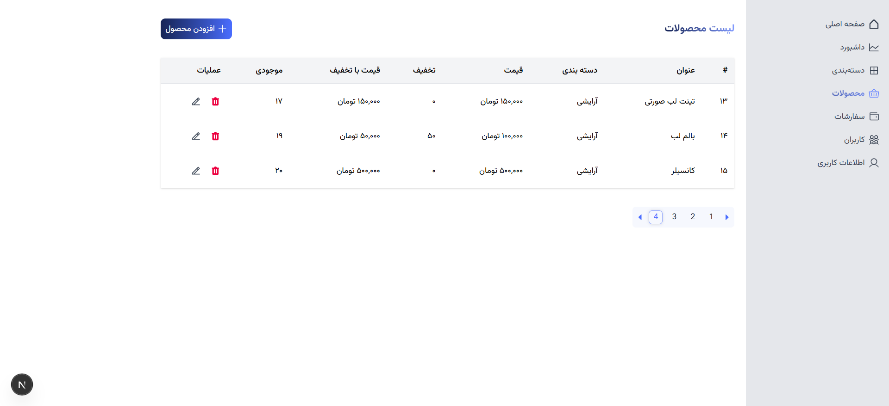
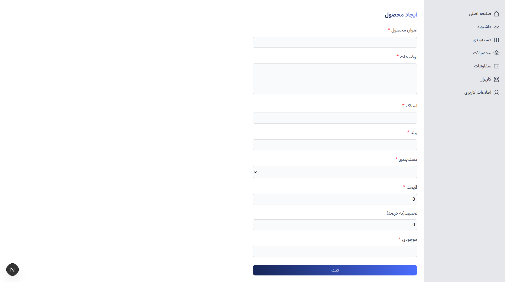

# 🛒 کارت | فروشگاه اینترنتی

فروشگاه اینترنتی **کارت** یک پلتفرم خرید آنلاین است که با **Next.js**، **Context API** و **Tailwind CSS** توسعه داده شده. این پروژه علاوه بر بخش کاربری (نمایش محصولات، دسته‌بندی‌ها، سبد خرید)، یک **پنل مدیریت (ادمین)** کامل هم داره که امکان ساخت و مدیریت محصولات و دسته‌بندی‌ها رو فراهم می‌کنه.

> 📌 این پروژه به‌صورت آنلاین دیپلوی نشده و فعلاً به‌صورت لوکال اجرا می‌شه.

---

## ✨ امکانات

### بخش کاربری
- نمایش لیست محصولات با کارت‌های محصول (Product Card)
- صفحه اختصاصی هر محصول با جزئیات کامل
- دسته‌بندی محصولات
- سبد خرید (افزودن، حذف و مدیریت تعداد آیتم‌ها)
- طراحی ریسپانسیو و راست‌چین (RTL) مناسب زبان فارسی

### پنل ادمین
- ساخت، ویرایش و حذف محصولات
- ساخت، ویرایش و حذف دسته‌بندی‌ها
- لیست کاربران و سفارشات

---

## 🛠️ تکنولوژی‌های استفاده‌شده

| بخش | تکنولوژی |
|---|---|
| فرانت‌اند | Next.js (App Router) |
| مدیریت state | React Context API |
| استایل‌دهی | Tailwind CSS |

---

## 📸 اسکرین‌شات‌ها

### صفحه اصلی


### صفحه لیست محصولات


### صفحه جزئیات محصول


### سبد خرید


### ورود
| مرحله ۱: ورود شماره تلفن | مرحله ۲: وارد کردن کد OTP |
|---|---|
|  |  |

### نمونه ای از صفحات ادمین
|  فرم ایجاد محصول | لیست محصولات برای ادمین|
|---|---|
|  |  |


---

## 📂 ساختار کلی پروژه

```
frontend-root/
├── app/
│   ├── (user)/              # صفحات کاربری (محصولات، سبد خرید و ...)
│   ├── (admin)/              # پنل مدیریت
│   ├── (profile)/              # پنل کاربر
│   ├── (auth)/              # لاگین
│   └── layout.js
├── components/               # کامپوننت‌های مشترک (Header, Footer, ProductCard, ...)
├── context/                  # Context
├── services/                  # api
├── public/
│   └── images/
│   └── fonts/
├── screenshots/               # عکس‌های README (اختیاری)
└── README.md

---

## 🚀 راه‌اندازی پروژه

```bash
# نصب پکیج‌ها
npm install

# اجرای پروژه در حالت توسعه
npm run dev

# ساخت نسخه production
npm run build
npm start
```

پروژه به‌صورت پیش‌فرض روی آدرس زیر بالا میاد:

```
http://localhost:3000
```

---

## 📄 لایسنس

این پروژه صرفاً برای اهداف آموزشی/شخصی توسعه داده شده است.
